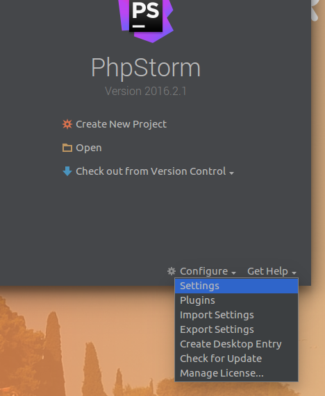

PhpStorm Settings
=================

First we fiddle a little bit around with some settings which are sadly not
default in PhpStorm.

Before you open any project you've still access to the settings dialog:

Keymap
------

First we adapt the keymap to remap some keys which are blocked by the default
Ubuntu Unity Desktop Environment. If you follow this on a Windows or OS X
machine you can still remap those to, they are practical.

Open the entry *Keymap* in the sidebar, select *Default for GNOME*, klick copy
and rename it to *Default for Unity*. Now search for the following Operations
and assign them the corresponding shortcuts:

| Operation | Keyboard Shortcut |
| --- | --- |
| VCS Operations Popup... | `Alt+V` |
| Surround With... | `Alt+S` |
| Surround with Live Template... | `Alt+T` |
| Reformat Code | `Ctrl+Shift+Y` | 
| Settings... | `Ctrl+Alt+Shift+S` |
| Main menu, Navigate, Select In... | `Ctrl+Shift+F1` |

Editor settings
---------------

In *Editor* → *General*:

- De-/activate *Honor "CamelHumps"..* if you like it or not.
- Set *Strip trailing spaces on Save* to *All*
- Activate *Ensure line feed at file end on Save*

In *Editor* → *General* → *Appearance*:

- Activate *Show line numbers*
 
In *Editor* → *General* → *Code Style*:

For *PHP* set the style from PSR-1/PSR-2.

For *YAML* set the indent to `4` as this is the used indent in nearly all PHP
projects using YAML.

Version Control
---------------

In *Version Control*:

- Activate *Commit message margin* and set to `72`
- Activate *Wrap when typing reaches margin*

PHP
---

In *Language & Frameworks* → *PHP*:

- Add a PHP interpreter on the ellipsis near *<no interpreter>*
- Also add `/usr/bin/php7.0` as interpreter
- And select *PHP 5.6* as default one

In *Language & Frameworks* → *PHP* → *Composer*:

- Get on a terminal and type `which composer`
- Add the resulting path to *Path to composer.phar*

Gitflow
-------

In *Other Settings* → *Gitflow*:

- Activate `-F` for features
- Activate `-F` and `-p` for releases 
- Activate `-F`, `-p` and `-n` for hotfixes

Plugins
-------

The following plugins are good to have them installed:

- .ignore
- BashSupport
- Git Flow Integration
- PHP Annotations
- PHP composer.json support
- Scratch
- Symfony Plugin

Recover
-------

Sorry, since the team settings repository seems buggy, there is no recovery
possible if you didn't follow all the steps here :(
